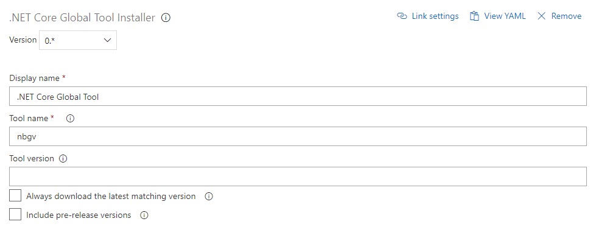
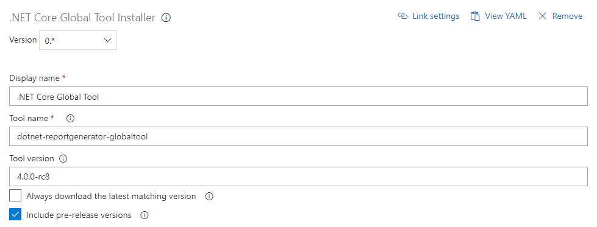

# .NET Core Global Tools installer.

Uses the dotnet cli to install a .NET Core Global Tool and adds that to the agent's tool cache.

Since (at the time of writing) the dotnet global tool installation process errors out if a tool is already installed and doesn't handle multiple version installed globally.

This task was written with private agents in mind, hosted agents are not affected by this since they are fresh for every build.

The .NET Global Tools are cached with their version, so different versions can be used in parallel, although the version discovery takes already installed versions into account.

## Options

### Tool name
The name of the tool for which it can be found on https://www.nuget.org/.

### Tool version
Specific version or version spec. This will be evaluated against the versions found on https://www.nuget.org/.

### Always download the latest matching version
Always check for and download the latest available version which satisfies the version spec. 

### Include pre-release versions
Determines if the version query against https://www.nuget.org/ will include pre-release versions.

## Screenshots

### Use any already installed version found or install the newest

### Use specific version only available as pre-release

## Credits
Logo: "[Tool](https://thenounproject.com/term/tool/1287941/)" icon by Mr Balind from [from the Noun Project](http://thenounproject.com/).